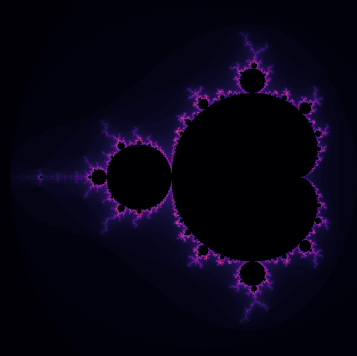

# Mandelbrot-Mini-Project
Implementation of the Mandelbrot set for the Numerical Scientific Computing Course (Computer Engineering 8th semester, AAU)

- To compare the performance between the algorithms run the [``main.py``](main.py) file.
- To generate a plot showing the mandelbrot set configure one of the parameters to ``show_figure=True`` in [``main.py``](main.py).

## Generated Content
Generated sequence of zoom into fractals [``AnimatingMandelbrotZoom/mandelbrot_animation.py``](AnimatingMandelbrotZoom/mandelbrot_animation.py)

High resoultion render of the mandelbrot set [``AnimatingMandelbrotZoom/mandelbrot_animation.py``](AnimatingMandelbrotZoom/mandelbrot_animation.py)

**Image computed using:**
- Size: (1e4, 1e4)
- Threshold: 100
- Iterations: 100
 

## Project Hand Ins
**Mini-Project Part 1** ([``Hand-In``](Part%201%20-%20Algorithms%20with%20performance%20analysis/Mini%20Project%20Report%20Part%201.pdf)) 
- Naive
- Vectorized
- Numba-optimized
- Parallel using multi-processing
- Computation analysis of speedup between parameters 
 
