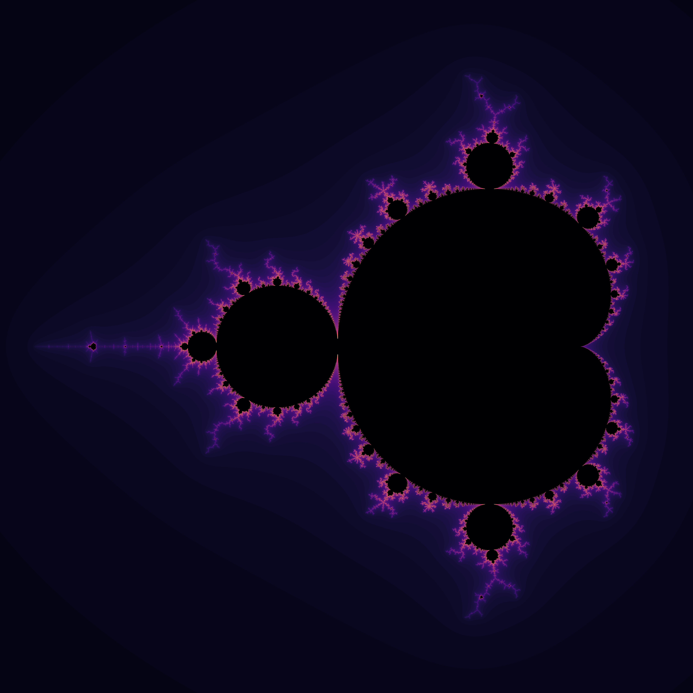

# Mandelbrot-Mini-Project
Implementation of the Mandelbrot set for the Numerical Scientific Computing Course (Computer Engineering 8th semester, AAU)

- To compare the performance between the algorithms run the [``main.py``](main.py) file.
- To generate a plot showing the mandelbrot set configure one of the parameters to ``show_figure=True`` in [``main.py``](main.py).

</br>

<!----------------------------------------->

## Generated Content

### High resolution render
High resoultion render of the mandelbrot set [``HighResolutionRender/ImageRender.py``](HighResolutionRender/ImageRender.py)


**Image computed using:**
- Size: (1e4, 1e4)
- Iterations: 100

</br>

### Animated Zoom

Generated sequence of zoom into fractal [``AnimatingMandelbrotZoom/mandelbrot_animation.py``](AnimatingMandelbrotZoom/mandelbrot_animation.py)

[Demo of zooming into fractal](https://www.youtube.com/watch?v=L2zKIrriDfI)

</br>

### Animated Iterations

Generated sequence of zoom into fractal [``AnimatingMandelbrotIterations/mandelbrot_iteration_animation.py``](AnimatingMandelbrotZoom/mandelbrot_animation.py)

[Demo of animating iterations](https://www.youtube.com/watch?v=8BjqgaIuses)

</br>


<!----------------------------------------->

## Performance Results
| Approach    | Computation Time (s) |
| ----------- | ----------- |
| [``mandelbrot_naive.py``](mandelbrot_naive.py)| 393.58 |
| [``mandelbrot_vectorized.py``](mandelbrot_vectorized.py)| 160.92 |
| [``mandelbrot_numba.py``](mandelbrot_numba.py)| 115.25 |
| [``mandelbrot_multicore.py``](mandelbrot_multicore.py)| 37.89 |
| [``mandelbrot_dask.py``](mandelbrot_dask.py)| 25.07 |

**Parameters**
- Size: 10.000x10.000
- Iterations: 100

**Specs**
- Intel® Core™ i5-11300H-processor @ 3.10GHz
- 16 GB DDR4 Ram @ 3200MHz

</br>

<!----------------------------------------->

## Setup
Install the necessary packages by running the command within the root project directory:

```shell
pip install -r requirements.txt
```
</br>

<!----------------------------------------->

## Project Hand Ins
**Mini-Project Part 1** ([``Hand-In``](Part%201%20-%20Algorithms%20with%20performance%20analysis/Mini%20Project%20Report%20Part%201.pdf))</br>
- Naive
- Vectorized
- Numba-optimized
- Parallel using multi-processing
- Computation analysis of speedup between parameters</br>

**Mini-Project Part 2** ([``Hand-In``](Part%202%20-%20DASK%20and%20Datatypes/Numerical%20Scientific%20Computing%20Mini%20Project%20Part%202.pdf))</br>
- Performance of data types (Numpy.Float64, Numpy.Float32, Numpy.Float16)
- Dask compared to numpy
- Dask local execution
- Dask distributed execution
- Performance optimizations (Early stopping, data types, lazy loading)

</br>

<!----------------------------------------->

## Group
- Lukas Bisgaard Kristensen 
